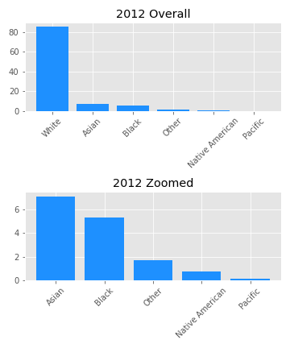

# Background

Every year ending in '2' and '7' the U.S. Census Bureau sends out surveys to companies to collect demographics on business owners.  This data is then compiled and made publically available their [website](https://www.census.gov/).  The questions asked in the Census Bureau's questioneers include race, ethnicity, gender, and other factors of interest among the company owner/s, employees, and the company itself.  These surveys are sent out across all major industries registerd with the U.S government.

    

## Method

Over the past several years there has been more focus on divirsity within the workplace.  I was curious if this focus extended to not only employees, but also business owners.  For scoping purpose, I am focusing in on race, ethnicity, and gender for owner charateristics.   I am also focusing soley on the Professional, Scientific, and Tecnical Services sector as it is the largest.  Finaly, I am using the past three surveys data sent out which includes 2007, 2012, and 2017.

## Data

As mentioned above, all of the data used in this project can be obtained directly from the Census Bureau's data and tables explorer found [here](https://data.census.gov/cedsci/).  For each year, there are approximately 2 million entries with over 200 columns of designaitons.  After scoping down, this consolidates to around 200,000 rows and 10 columns of traits.  This process of data refinement was particularly difficult because much of the traits can have multiple designations.  Some examples are multi-racial owners, or companies equally owned by men and women.  These differences in questions asked, options for replies, and number of responses between the years, made exact comparison very difficult.

    

## Exploratory Data Analysis

From early investigations, there were differences in the distributions of business owners across these demographics:

    
    
    

In the above graphs the "Zoomed" version is a focus on minority populaitons within the distributions.  This was added to provide enough detail to display any variance among those populations.  Even with this view, it is difficult to see any major changes or things of note.

## Visualization

    

## Conclusion

I do not believe there is enough evidence to justify claiming there has been continued progress towards diversifying the populaiton of business owners.  With the discrepancies in survey method mentioned previously and the inconcise data, I believe there needs to be more investigation to come to a definative result.

### Reflection

Lessons learned from this first capstone:
 - Data cleaning is important, but focus on analysis
 - Quality if data is just as, if not more so, important as quantity
 - Explore data early and often

#### Credits

Title photo from this [link](https://www.google.com/url?sa=i&url=https%3A%2F%2Ftowardsdatascience.com%2Faccessing-census-data-with-python-3e2f2b56e20d&psig=AOvVaw0dgzIG1WcGGle9Cfm4tfVp&ust=1614429873497000&source=images&cd=vfe&ved=0CA0QjhxqFwoTCIieiozKh-8CFQAAAAAdAAAAABAD).  
All data from [data.census.gov](https://data.census.gov/cedsci/).  
Code, plots, and explaination from Alex Eldredge. # capstone1
# capstone1
